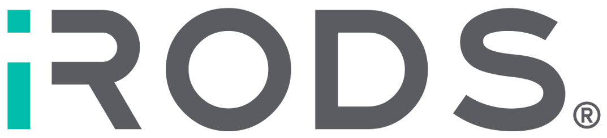

<!--
BSD 3-Clause License All rights reserved.

SPDX-License-Identifier: BSD 3-Clause License
-->

# iRODS-K8s Staging
The iRODS-K8s Staging workflow step microservice.

#### Licenses...

#### Components and versions...

#### Build status...

## Description
The iRODS-K8s Staging product is a microservice used in the iRODS K8s Supervisor workflow step to:
 - Perform data initializations and create configuration files for standup and testing.
 - Performs finalization operations when the workflow is complete.

There are GitHub actions to maintain code quality in this repo:
 - Pylint (minimum score of 10/10 to pass),
 - Build/publish a Docker image.
